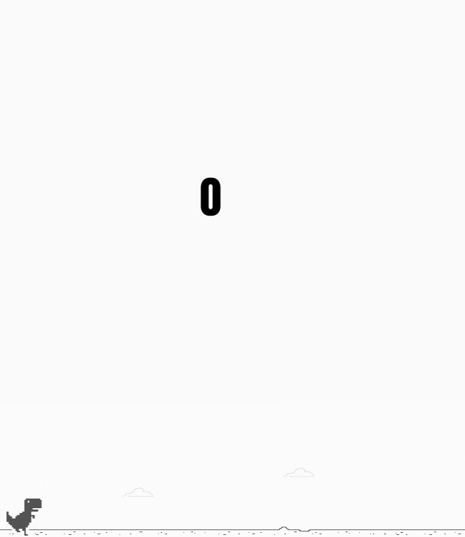

# Dino Game

This project is part from the course "Creating a Snake game style with HTML5 and CSS3" from [Digital Innovation One](https://web.digitalinnovation.one/) using Javascript.

    

---

# Guide

- [Features](#features)
- [Installation](#installation)
- [Using](#using)
- [Technologies](#technologies)
- [Future Implementations](#future-implementations)

# Features

- Users can control the dino.
- Users can jump cactus and earn points.

# Installation

`git clone https://github.com/cledman/javascript-dino-game.git`

# Using

`Run the index.html file`

# Technologies

- [HTML](https://www.w3schools.com/html/) to write the page,
- [CSS](https://www.w3schools.com/css/) to handle the styles, layout and rendering,
- [JavaScript](https://developer.mozilla.org/en-US/docs/Web/JavaScript) to handle the game commands.

# Future Implementations

- We could have some music and sound effects.
- We could have more animations.

Thanks to:

- [Celso Henrique](https://www.linkedin.com/in/devfrontend/)

##
